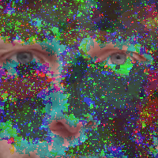
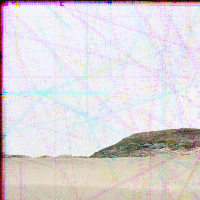
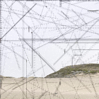

pbugs
=====

Pixel Bugs consume pixels from photographs for energy (and eventually to reproduce.)

May 29, 2015
------------

Playing in a branch I called 'rust'. This removes bug movmement and replaces it with a more mold/rust like growth.

May 23, 2015
------------

Added a color preference. Bugs prefer R, G or B. Also added waste so that eating R produces a small amount of G, eating G produces B, and so on.

May 22, 2015
------------

Very simple bugs eating pixels and dying:

